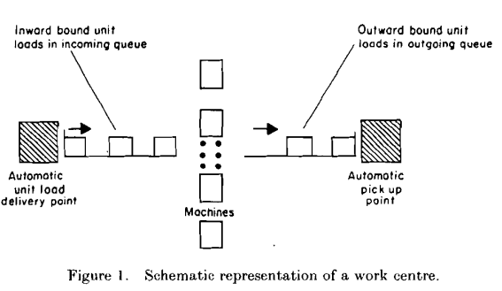
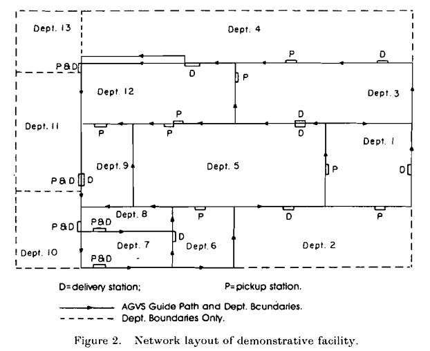
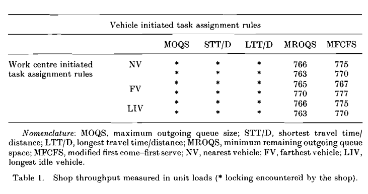
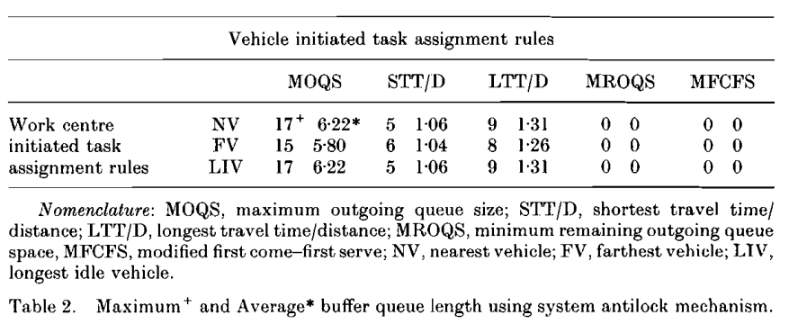
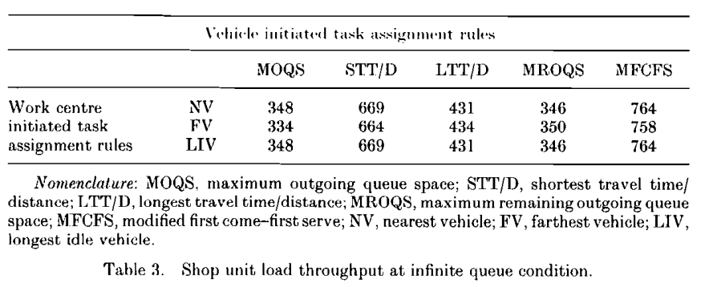
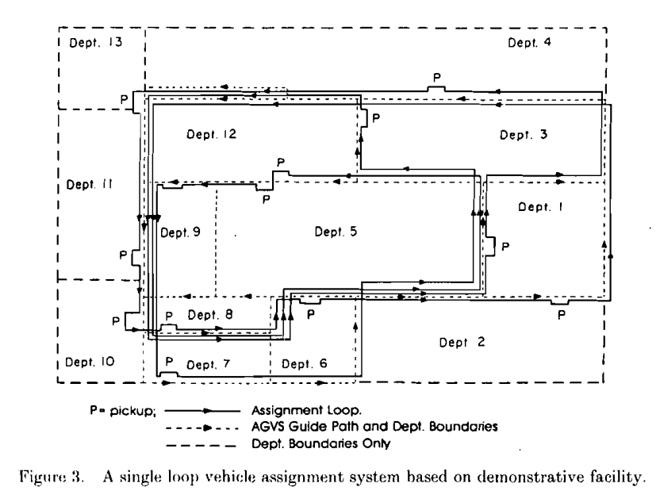
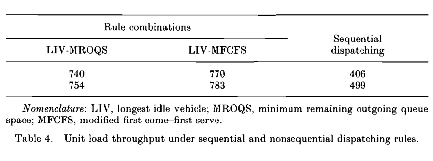
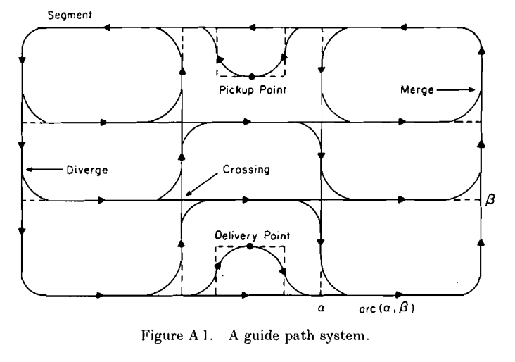
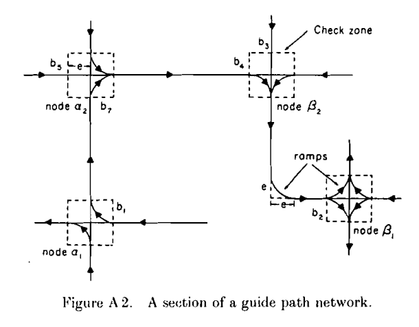
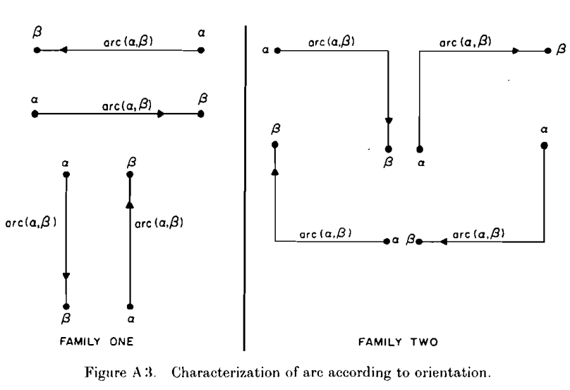

# Paper 1: Characterization of automatic guided vehicle dispatching rules

**Authors:** Pius J. Egbelu & Jose M. A. Tanchoco
**Year:** 1984
**Journal:** International Journal of Production Research

## 1. Core Concept: The Dispatching Dichotomy
This paper establishes the foundational framework for all AGV dispatching by splitting the problem into two distinct categories:

1. **Work-centre initiated task assignment:** 
   - *Logic:* A work center has a task ready and needs to select an AGV from a pool of idle AGVs.
   - *Analogy for Thesis:* A Quay Crane (QC) needs a container moved. Which of the idle AGVs should we send to it? (Matching AGV to Task).
   
   

*Figure 1: Schematic representation of a work centre*

2. **Vehicle initiated task assignment:**
   - *Logic:* An AGV just finished a drop-off and is now idle. It must look at all the requesting work centers and decide which one to serve.
   - *Analogy for Thesis:* An AGV just dropped a container at the Yard Block. Which QC should it drive to next? (Matching Task to AGV).

## 2. Environment / Assumptions
- **Setting:** Job shop manufacturing environment (not a container terminal, but the logic perfectly transfers).
- **Triggers:** Decisions are triggered discretely (either an AGV becomes empty, or a load enters an output queue).

## 3. Relevance to Thesis (Inferences)
- **MDP Trigger Design:** This dichotomy forces a critical design question for our DQN agent. **When does our RL agent make a decision?** Does it act when a QC needs an AGV (Work-center initiated)? Or does it act when an AGV becomes empty (Vehicle-initiated)? Or both? 
- *Note:* Most modern DRL papers use *Vehicle-initiated* triggers (state is evaluated when the AGV finishes its task), but minimizing QC idle time might require *Work-center initiated* foresight.

## 4. Dispatching Rules Inventory (Part 1: Work-Centre Initiated)

Here are the rules defined for when a machine needs an AGV, including their exact mathematical formulations:

1. **Random Vehicle (RV) rule:** 
   - Randomly assign any available idle vehicle, regardless of distance.

2. **Nearest Vehicle (NV) rule:** 
   - **Equation:** $d_j = \min \{d_i\}$ for all idle vehicles $i$.
   - **Distance Computation:** $d_i = d_i' + \sum_{k=1}^{J-1} d(n_k, n_{k+1})$
     - $J$: Number of nodes along the shortest path.
     - $d_i'$: Distance to the next node (0 if the AGV is currently exactly on a node; otherwise, the distance remaining to reach the next node).
     - $d(n_k, n_{k+1})$: Distance between adjacent nodes on the path.
   - **Time-based alternative:** If speeds vary, pick $j$ such that $d_j/s_j = \min \{d_i/s_i\}$, where $s_i$ is the speed of vehicle $i$.

3. **Farthest Vehicle (FV) rule:** 
   - **Equation:** $d_j/s_j = \max_{\forall i} \{d_i/s_i\}$
   - Antithetical rule used only for system stress-testing.

4. **Longest Idle Vehicle (LIV) rule:** 
   - **Equation:** $t_j = \max_{\forall i} \{t_i\}$
   - **Where:** $t_i = T_c - T_i$
     - $T_c$: Current time (time the decision is being made).
     - $T_i$: The exact time vehicle $i$ was last set to idle.

5. **Least Utilized Vehicle (LUV) rule:** 
   - **Equation:** $U_j = \min_{\forall i} \{U_i\}$
   - **Where:** $U_i$ is the historical mean utilization of vehicle $i$ up to the current time.

## 5. Dispatching Rules Inventory (Part 2: Vehicle Initiated)

Here are the rules defined for when an AGV becomes idle and multiple work centres are requesting service (How does the AGV pick which task to do?):

1. **Random Work Centre (RW) rule:** 
   - Randomly select a work centre from the list of those requesting service.

2. **Shortest Travel Time/Distance (STT/D) rule:** 
   - Dispatch the vehicle to the work centre that is physically closest to the vehicle. 
   - **Crucial Warning (The Locking Phenomenon):** The authors warn that if a work centre is physically isolated, STT/D might constantly ignore it in favor of closer centres. Its output queue will fill up, blocking its machines, which fills its input queue, eventually causing a factory-wide stalemate (gridlock).

3. **Longest Travel Time/Distance (LTT/D) rule:** 
   - Antithetical rule. Pick the farthest work centre (for testing only).

4. **Maximum Outgoing Queue Size (MOQS) rule:** 
   - **Equation:** $q_j = \max \{q_k\}$ for all $k$ where $R_k \ge 1$.
   - **Variables:**
     - $q_k$: The total number of unit loads sitting in the outgoing queue of work centre $k$.
     - $R_k$: The number of unit loads in that queue that have *not yet been assigned* to another AGV. (We only consider centres where $R_k \ge 1$).
   - **Logic:** Send the AGV to the station with the biggest pile of finished parts waiting.

5. **Minimum Remaining Outgoing Queue Space (MROQS) rule:** 
   - **Equation:** $C_i = \min \{C_k\}$ for all $k$ where $R_k \ge 1$.
   - **Where:** $C_k = Q_k - S_k$
     - $Q_k$: The maximum capacity of the output queue.
     - $S_k$: The current length (number of items) in the output queue.
   - **Logic:** $C_k$ is the remaining empty space. This rule sends the AGV to the station that is closest to overflowing.

6. **Modified First Come-First Serve (MFCFS) rule:** 
   - A time-based rule. The AGV goes to the department with the earliest saved request time.
   - **Modification:** A department can only have ONE outstanding request saved at a time. This prevents a very busy department from hoarding all the AGVs in the queue.

7. **Unit Load Shop Arrival Time (ULSAT) rule:** 
   - **Equation:** $T_i^* = \min \{T_k\}$ for all $k$ where $R_k \ge 1$.
   - **Where:** $T_k$ is the time the specific unit load (part) first arrived into the *entire factory*.
## 6. Simulation Results & The Locking Phenomenon (Table 1)

The authors tested 15 combinations of these rules (3 Work-centre rules $\times$ 5 Vehicle rules) using a simulation of a 13-department factory with 6 AGVs (Figure 2). 

*Figure 2: Network layout of demonstrative facility*

**The Results (Table 1):**
- Throughput was measured to determine the best rule combination.
- **Disaster:** Every combination using MOQS (Max Queue), STT/D (Shortest Distance), or LTT/D (Longest Distance) resulted in **Shop Locking** (denoted by asterisks `*`). The factory gridlocked and throughput crashed to almost zero.
- **Success:** Only MROQS (Minimum Remaining Space) and MFCFS (First Come First Serve) survived without locking, producing high throughput (~760-777 unit loads).

*Table 1: Shop throughput measured in unit loads (asterisks indicate locking)*

**Why did STT/D cause a complete factory crash? (The Domino Effect)**
1. Because AGVs always take the closest job (STT/D), physically isolated departments get ignored.
2. The ignored department's output queue fills to maximum capacity.
3. Because the output is full, the machines are blocked from working.
4. Because the machines aren't working, the input queue fills to maximum capacity.
5. An AGV arrives to drop off a new part, but the input queue is full. The AGV cannot unload, so it gets stuck in the aisle.
6. The stuck AGV blocks the path for all other AGVs. **Gridlock.**

**Why didn't the Work-Centre rules (NV vs FV vs LIV) matter?**
Table 1 shows almost identical performance whether they used Nearest Vehicle, Farthest Vehicle, or Longest Idle. Why? 
- Because in a busy factory, **AGVs are rarely idle**. 
## 7. Fixing the Gridlock (Buffers & Infinite Queues)

Since rules like STT/D (Shortest Distance) and MOQS caused the factory to crash, the authors tested two hypothetical ways to save it.

### Fix 1: The Central Buffer Area (Table 2)
When the factory gets stuck, operators can intervene by forcing blocked AGVs to dump their loads into a temporary holding area ("Central Buffer") to clear up traffic. 

**Findings:**
- This band-aid fixed the STT/D gridlock, increasing throughput from ~108 up to ~596 unit loads.
- **Buffer Requirements (Table 2):** Look at the buffer queue lengths required to make this work. STT/D required an average buffer space of 1 to 6 units. MOQS was the worst, requiring up to **17 unit spaces** just to prevent gridlock! 
- **The True Winners:** MROQS and MFCFS required exactly **0** buffer space. They never got stuck in the first place, proving they are mathematically superior without needing manual intervention.

*Table 2: Buffer queue length using system antilock mechanism*

### Fix 2: Infinite Queues (Table 3)
What if the physical machines had infinite floor space (infinite input/output boxes)? Gridlock becomes mathematically impossible because no machine ever blocks another. 

**Findings:**
- Under these magical conditions, the Time-based rule (MFCFS) absolutely dominated, achieving the highest throughput (758-764 unit loads).
- Interestingly, STT/D (Shortest Distance) finally performed well, achieving ~669 throughput. 
- **The Fatal Flaw:** While STT/D looked competitive on paper, it survived *only* because it forced the ignored departments to pile up **231 finished parts** waiting for an AGV. The authors concluded that STT/D is practically inoperable in the real world, as no factory can afford to build a layout with space for 231 buffered units at a single machine.

*Table 3: Shop unit load throughput at infinite queue condition*

## 8. The "Bus Route" Alternative (Sequential Dispatching)

Instead of using complex rules, the authors propose a simpler alternative: 
- Pre-program the AGVs to drive in a continuous, fixed loop around the factory (like a city bus route).
- If a station has a part, pick it up. If not, keep driving.

*Figure 3: A single loop vehicle assignment system*

**Advantage:** It mathematically guarantees the factory will never lock.
**Disadvantage:** In a complex factory, finding the optimal loop is a Traveling Salesman Problem (TSP). Furthermore, AGVs waste time visiting empty stations.

**Results (Table 4 data):** The sequential loop performed terribly. It only achieved **406-499** throughput, compared to **740+** for the dynamic MROQS/MFCFS rules. The authors conclude that sequential routing is only justified if your traffic control algorithms are too simple to handle complex dynamic routing. 

*Table 4: Unit load throughput under sequential and nonsequential dispatching rules*

## 9. Conclusion
The paper concludes that dispatching rules based strictly on distance have severe drawbacks unless the factory layout is perfectly optimized. The choice of dispatching rule directly dictates how much buffer space a factory must build into its layout.

## 10. Appendix: Network Distance Mathematics

For coding an exact simulation, the authors define how to calculate the actual distance between two adjacent nodes ($\alpha$ and $\beta$), taking into account the physical turning radius of an AGV on the guide paths.

*Figure A1: A guide path system*

*Figure A2: A section of a guide path network*

**Definitions:**
- $\phi$: A binary flag. `1` if the AGV has to make a turn to reach node $\beta$, `0` if it goes straight.
- $e$: The distance from the "check point" (where the AGV stops to look for traffic) to the center of the node.
- $f$: The length of the curved ramp the AGV drives on to make a turn.

**Distance Equations ($d_{\alpha\beta}$):**
- **Straight Line (Euclidean):** 
  $d_{\alpha\beta} = \sqrt{(x_\alpha - x_\beta)^2 + (y_\alpha - y_\beta)^2} + (f - 2e)\phi$
- **Diagonal/Turn (Rectilinear):** 
  $d_{\alpha\beta} = |x_\alpha - x_\beta| + |y_\alpha - y_\beta| + (f - 2e)(\phi + 1)$

*Logic:* If the AGV turns ($\phi=1$), the math calculates the straight-line distance, subtracts the straight lines going directly into the intersection ($2e$), and adds back the curved ramp distance ($f$).

*Figure A3: Characterization of arc according to orientation*

## 11. Final Takeaways for the Thesis

For the development of our Deep Reinforcement Learning (DRL) agent and simulation environment, this paper establishes the following critical foundations:

1. **Our Framework:** It suggests our DRL agent will likely act as a **Work-Centre Initiated** decision-maker. When a Quay Crane (QC) needs a container, it must select an AGV from the fleet (matching a vehicle to a task).
2. **Our Baseline:** The paper provides the exact mathematical definition for the **Nearest Vehicle (NV)** rule, which will serve as a primary greedy baseline to evaluate our DRL against. 
3. **The Gridlock Danger:** We must be extremely careful when we eventually design our simulation layout. The "Locking Phenomenon" proves that blindly dispatching AGVs based strictly on shortest distance (like NV) can easily cause deadlocks if buffer capacities (like QC transfer points) fill up. 
4. **High-Traffic Reality:** When we define our fleet size and layout, we must account for high congestion. The paper proves that in busy systems, AGVs are rarely idle. Therefore, when we eventually design our DRL state space, it must track not just *idle* AGVs, but AGVs that are *about* to become idle (currently in transit) to accurately manage traffic and prevent system collapse.

